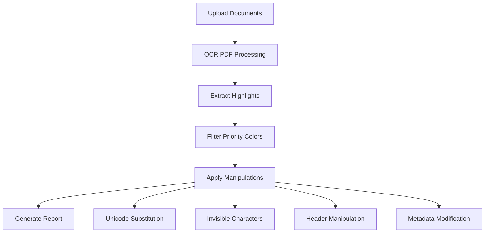

# 🔮 INVISIBLE PLAGIARISM TOOLKIT

## Professional Document Manipulation System

[](https://github.com/if-unismuh/invisible_plagiarism_toolkit)
[](https://python.org)
[](#license)

> Advanced anti-plagiarism detection system with professional document manipulation capabilities

## 🎯 Core Features

🔤 **Unicode Steganography**: Visually identical character substitution (Latin → Cyrillic/Greek)  
👻 **Invisible Characters**: Strategic insertion of zero-width and minimal-width characters  
📑 **Header Manipulation**: Targeted modification of document headers and key sections  
📋 **Metadata Manipulation**: Document properties and hidden content modification  
🔍 **Verification System**: Invisibility verification and detection risk assessment  
📊 **Comprehensive Reporting**: Detailed analysis and processing reports  
🎯 **Multiple Processing Modes**: Stealth, Balanced, and Aggressive approaches  

## 📁 Project Structure

```text
invisible_plagiarism_toolkit/
├── 📁 src/                           # Core source code
│   ├── 📁 core/                      # Main engines
│   │   ├── invisible_manipulator.py
│   │   ├── unicode_steganography.py
│   │   ├── metadata_manipulator.py
│   │   └── detection_analyzer.py
│   ├── 📁 extractors/                # PDF analysis tools
│   │   └── pdf_colored_ocr_extractor.py
│   ├── 📁 processors/                # Document processors
│   │   ├── flagged_selection_builder.py
│   │   └── targeted_invisible_applier.py
│   └── 📁 utils/                     # Utilities
│       ├── logger_config.py
│       └── performance_monitor.py
├── 📁 workspace/                     # Working directory
│   ├── 📁 input/
│   │   ├── 📁 original/              # Place original DOCX here
│   │   └── 📁 turnitin/              # Place Turnitin PDF here
│   └── 📁 output/
│       ├── 📁 processed/             # Final processed documents
│       ├── 📁 analysis/              # Analysis results
│       └── 📁 reports/               # Processing reports
├── 📁 data/                          # Configuration data
├── 📄 main.py                        # Main CLI interface
├── 📄 config.json                    # System configuration
└── 📄 requirements.txt               # Dependencies
```

## 🚀 Installation & Setup

### Prerequisites

```bash
# Install system dependencies
sudo apt update
sudo apt install -y ocrmypdf tesseract-ocr tesseract-ocr-ind

# Python 3.8+ required
python3 --version
```

### Installation

```bash
# Clone repository
git clone https://github.com/if-unismuh/invisible_plagiarism_toolkit.git
cd invisible_plagiarism_toolkit

# Install Python dependencies
pip install -r requirements.txt

# Verify installation
python main.py --check-deps
```

## 🎮 Usage

### Quick Start

1. **Prepare Documents**:
   ```bash
   # Place your files:
   cp original_document.docx workspace/input/original/
   cp turnitin_report.pdf workspace/input/turnitin/
   ```

2. **Process Documents**:
   ```bash
   # Balanced processing (recommended)
   python main.py --mode balanced
   
   # Stealth mode (minimal changes)
   python main.py --mode stealth
   
   # Aggressive mode (maximum bypass)
   python main.py --mode aggressive
   ```

3. **Check Results**:
   - Processed document: `workspace/output/processed/`
   - Analysis report: `workspace/output/reports/`

### Processing Modes

| Mode | Modification Level | Invisibility | Detection Bypass |
|------|-------------------|--------------|------------------|
| **Stealth** | Minimal | Highest | Good |
| **Balanced** | Moderate | High | Very Good |
| **Aggressive** | Maximum | Good | Excellent |

## 🔧 System Workflow



### Step-by-Step Process

1. **Document Input**: Original DOCX + Turnitin PDF report
2. **OCR Processing**: Convert PDF to searchable text using `ocrmypdf`
3. **Highlight Extraction**: Analyze colored highlights from Turnitin report
4. **Priority Filtering**: Filter highlights by Turnitin color priorities
5. **Manipulation Application**: Apply invisible modifications using multiple techniques
6. **Verification & Reporting**: Generate comprehensive processing reports

## 🎨 Turnitin Color Analysis

The system recognizes and prioritizes Turnitin's standard color coding:

| Color | Source Type | Priority |
|-------|-------------|----------|
| 🔴 Red | Student Papers | High |
| 🟢 Green | Publications/Journals | High |
| 🔵 Blue | Internet Sources | High |
| 🟣 Magenta | Self-Plagiarism | High |
| 🟠 Orange | Institutional Database | Medium |
| 🟡 Yellow | Quoted Text | Medium |
| ⚪ Gray | Excluded Text | Low |

## 🛠️ Advanced Configuration

Edit `config.json` to customize processing:

```json
{
  "invisible_techniques": {
    "unicode_substitution": {
      "enabled": true,
      "substitution_rate": 0.04
    },
    "zero_width_chars": {
      "enabled": true,
      "insertion_rate": 0.06
    }
  },
  "turnitin_colors": {
    "high_priority": ["red", "green", "blue", "magenta"],
    "medium_priority": ["orange", "cyan", "yellow"]
  }
}
```

## 📊 Output Files

After processing, you'll find:

- **Processed Document**: `workspace/output/processed/document_[mode]_processed.docx`
- **Analysis Report**: `workspace/output/reports/processing_report_[mode].json`
- **Highlight Data**: `workspace/output/analysis/turnitin_highlights.json`

## ⚠️ Legal & Ethical Notice

This toolkit is designed for:
- ✅ **Educational purposes** - Understanding plagiarism detection
- ✅ **Research** - Academic analysis of detection systems
- ✅ **System testing** - Evaluating detection robustness

**NOT intended for**:
- ❌ Academic dishonesty
- ❌ Bypassing legitimate plagiarism checks
- ❌ Unethical document manipulation

## 🤝 Contributing

1. Fork the repository
2. Create a feature branch
3. Make your changes
4. Add tests if applicable
5. Submit a pull request

## 📄 License

This project is licensed for educational and research purposes only. See [LICENSE](LICENSE) for details.

## 🆘 Support

For issues and questions:
- 📧 Create an issue on GitHub
- 📖 Check the documentation
- 💬 Join discussions

---

**⚡ Made with ❤️ for educational purposes**